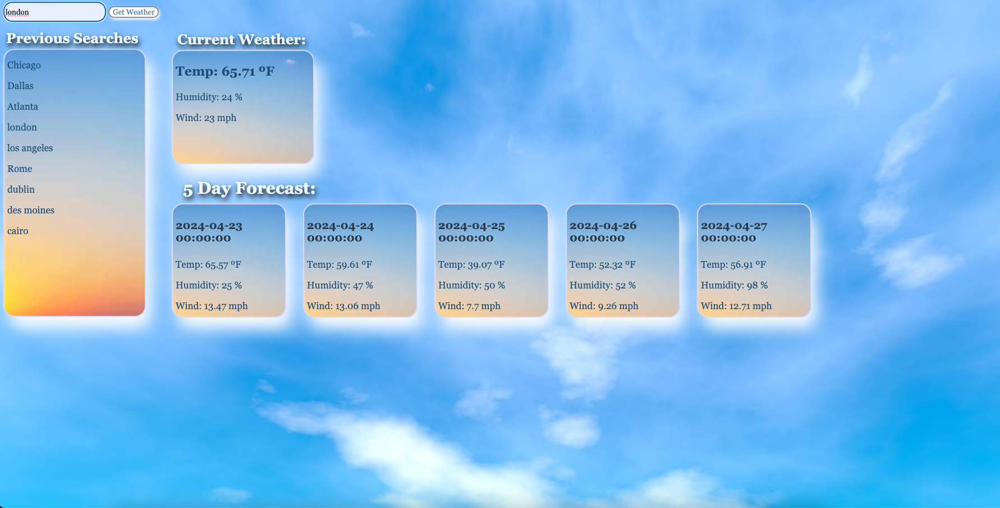
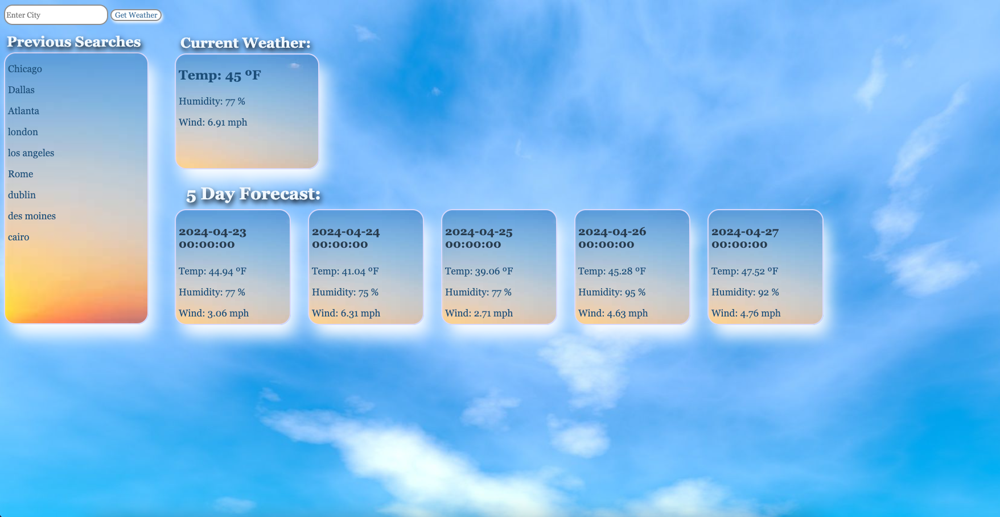

Description:

Third Party Weather API project where "openweathermap.org" was used to to extract weather data. 2 Functions were used to fetch data for the current weather within a given city and then be appended onto the webpage. The next function followed a simlar process, but appended a five day forecast onto separate cards for each day of the week. The user will input a particular city into the text box, click "get weather" and the weather data for that city will appear on the current weather card and five day forecast cards. The previous searches the user inputted will also appear in a card below the text box after they search.
The temperature (farenheight), humidity, and wind are all dispalyed to the user. 

Unable to accomplish:
I was unable to accomplish the clickable search history.

Screenshots:
 

 

Sources:
body background image: https://i.pinimg.com/originals/51/ea/69/51ea69d511899d2dae67fc2b3dc65734.jpg
card background image: https://duckduckgo.com/?q=clear+background&iar=images&iax=images&ia=images&iai=https%3A%2F%2Fwallpapercave.com%2Fwp%2Fwp6680277.jpg